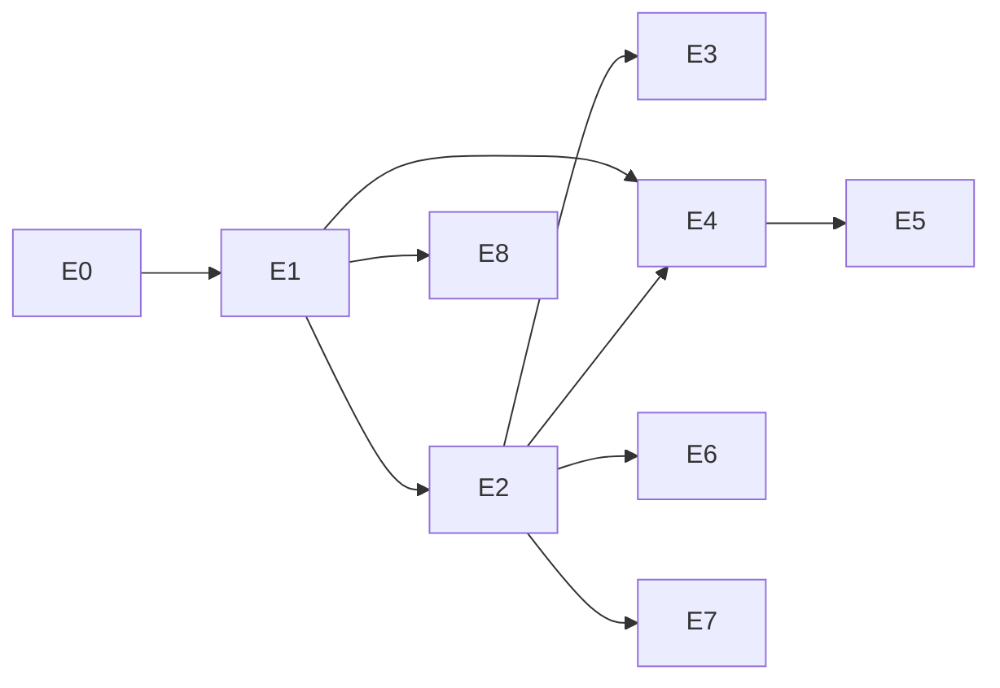

# Épicos

| ID | Épico | Objetivo | SPECs | Status |
|---|---|---|---|---|
| **E0** | Fundação e gates | O repositório impede, por máquina, que as invariantes sejam violadas | SPEC-000 | Aprovada |
| **E1** | Gateway de inferência | Toda inferência passa pelo Control Plane, multiprovider, medida | SPEC-001 | Em revisão |
| **E2** | Política e budget | Quem pode usar o quê, e até quanto | SPEC-002, SPEC-003 | Rascunho |
| **E3** | Painel admin | Admin configura workspaces, modelos, tools, budgets sem deploy | SPEC-004 | Rascunho |
| **E4** | App desktop | Colaborador conversa com o agente a partir do desktop | SPEC-005 | Rascunho |
| **E5** | Memória local | Agente lembra do trabalho do usuário, sem o dado sair da máquina | SPEC-006 | Rascunho |
| **E6** | KB corporativa (RAG) | Agente responde com o conhecimento da empresa, respeitando ACL | SPEC-007 | Rascunho |
| **E7** | Tools via MCP + aprovação | Agente age em sistemas externos, sob política e confirmação | SPEC-008 | Rascunho |
| **E8** | Observabilidade e custo | Custo, tokens e traço visíveis por workspace/usuário/conversa | SPEC-009 | Rascunho |

## Dependências

**Caminho crítico:** E0 → E1 → E2 → E4. É a fatia vertical que prova o produto:
colaborador conversa, pelo desktop, com um modelo que a política permitiu e o budget
autorizou, sem chave na máquina.
