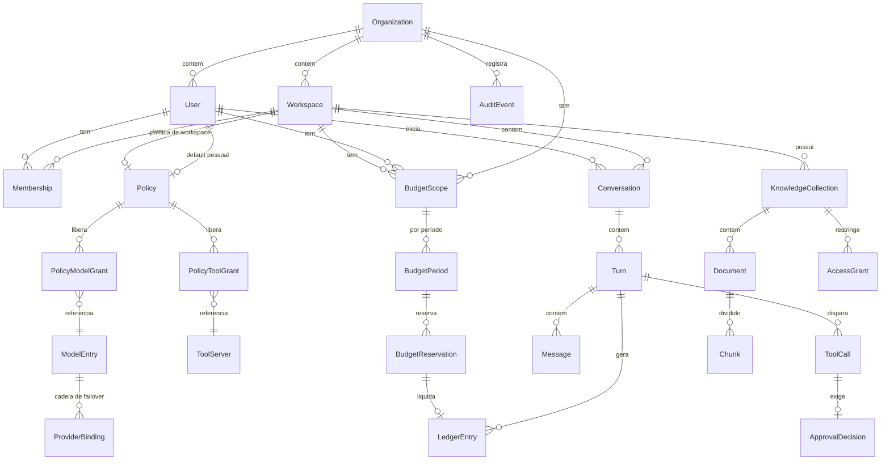

# Modelo de domínio

> **Decisão antecipada de propósito.** Entidade e relação são caras de reverter
> (migração de banco + quebra de contrato). Detalhe de tela e de fluxo é barato e fica
> para a SPEC de cada épico.
>
> Este documento é a fonte da verdade sobre **o que existe** no sistema. Toda SPEC que
> introduzir ou alterar entidade atualiza este arquivo **antes** de ser aprovada.

## Convenções gerais

| Regra | Valor |
|---|---|
| Identificador | ULID em texto, prefixado por tipo: `ws_01J…`, `usr_01J…`, `conv_01J…` |
| Timestamps | `created_at`, `updated_at` em UTC, sempre presentes |
| Exclusão | Soft delete (`deleted_at`) em tudo que aparece em auditoria. Hard delete só via runbook |
| Tenancy | Toda tabela de negócio carrega `org_id`. Query sem filtro de org é bug |
| Dinheiro | Inteiro em centavos de BRL (`cost_cents`). Nunca float |
| Tokens | Inteiro. Nunca estimado quando o valor real está disponível |
| Enum | Texto com CHECK no banco, `StrEnum` no Python. Nunca inteiro mágico |

## Mapa



---

## 1. Identidade e agrupamento

### Organization
A empresa. Raiz de tenancy e de budget.

| Campo | Tipo | Nota |
|---|---|---|
| `id` | `org_…` | |
| `name` | texto | |
| `default_policy_id` | FK Policy? | usado quando um workspace não define política |

### User
Colaborador. **Nunca guarda credencial de provider.**

| Campo | Tipo | Nota |
|---|---|---|
| `id` | `usr_…` | |
| `org_id` | FK | |
| `email` | texto | único por org |
| `is_admin` | bool | admin de org, não de workspace |
| `personal_policy_id` | FK Policy? | o "default pessoal" da cascata |

### Workspace
Unidade de política e de budget. Um usuário pode pertencer a vários.

| Campo | Tipo | Nota |
|---|---|---|
| `id` | `ws_…` | |
| `org_id` | FK | |
| `name` | texto | |
| `policy_id` | FK Policy? | **null significa "sem política", não "liberado"** |

### Membership
Relação usuário↔workspace.

| Campo | Tipo | Nota |
|---|---|---|
| `user_id`, `workspace_id` | FK | chave composta |
| `role` | enum | `member` \| `manager` |

> `manager` administra o workspace. Não pode conceder além do que a org permite.

---

## 2. Política

### Policy
Um mesmo formato serve para política de workspace e default pessoal. **O escopo muda
o poder, não a forma.**

| Campo | Tipo | Nota |
|---|---|---|
| `id` | `pol_…` | |
| `scope` | enum | `org` \| `workspace` \| `personal` |
| `approval_mode` | enum | `auto` \| `confirm` \| `deny` |
| `max_tokens_per_turn` | int | |
| `max_turns_per_conversation` | int | |
| `max_cost_cents_per_conversation` | int | |
| `knowledge_collection_ids` | lista FK | coleções da KB acessíveis |

Concessões são tabelas separadas, não JSON solto — para dar para consultar
"quem pode usar o modelo X" sem varrer tudo:

- **PolicyModelGrant**: `policy_id` × `model_entry_id`
- **PolicyToolGrant**: `policy_id` × `tool_server_id`

### Política efetiva

```
resolve(user, workspace) -> EffectivePolicy:
    if workspace.policy_id is not None:
        base = policy(workspace.policy_id)
    elif user.personal_policy_id is not None:
        base = policy(user.personal_policy_id)
    else:
        return DENY_ALL
```

**Invariante P1 — não-ampliação.** Quando existe política de workspace, o default
pessoal **não** entra na conta. Ele nunca soma permissão; só vale onde o workspace é
omisso. Formalmente: `efetiva ⊆ workspace` sempre que `workspace` existe.

**Invariante P2 — fail-closed.** Ausência, erro de leitura, falha de validação ou
timeout resolvem para `DENY_ALL`. Nunca para um default permissivo.

**Invariante P3 — endurecimento unidirecional.** Uma política pode tornar uma
ferramenta mais restrita (`auto` → `confirm` → `deny`), nunca menos. Ferramenta com
efeito externo ou destrutivo é `confirm` no mínimo, independente do que a política diga.

`EffectivePolicy` é um objeto **derivado**, calculado e cacheado com TTL e assinatura.
Não é tabela. Cache expirado ou assinatura inválida ⇒ P2.

---

## 3. Modelos e provedores

### ModelEntry
O **id lógico** que o cliente usa. Ex.: `fast-general`, `deep-reasoning`.

| Campo | Tipo | Nota |
|---|---|---|
| `id` | `mdl_…` | |
| `logical_name` | texto | único por org; é o que aparece na UI |
| `enabled` | bool | |

### ProviderBinding
Um elo da cadeia de failover de um `ModelEntry`.

| Campo | Tipo | Nota |
|---|---|---|
| `model_entry_id` | FK | |
| `position` | int | 0 = primário; ordem de failover |
| `provider` | enum | `anthropic` \| `openai` \| `google` \| … |
| `provider_model` | texto | o id concreto do provider |
| `price_input_per_mtok_cents` | int | |
| `price_output_per_mtok_cents` | int | |
| `price_cache_read_per_mtok_cents` | int | |
| `max_output_tokens` | int | |

**Invariante M1.** O cliente **nunca** envia `provider` nem `provider_model`. Só
`logical_name`. Trocar provider é editar `ProviderBinding` — sem deploy, sem tocar cliente.

**Invariante M2.** Credencial de provider **não** é campo destas tabelas. Vive no vault,
referenciada por nome, lida só pelo módulo `router/`.

### ToolServer
Servidor MCP disponível.

| Campo | Tipo | Nota |
|---|---|---|
| `id` | `tool_…` | |
| `name`, `transport`, `endpoint` | | |
| `has_side_effects` | bool | `true` força `confirm` no mínimo (P3) |

---

## 4. Budget

### BudgetScope
Onde um teto se aplica. **Escopos são hierárquicos e todos são verificados.**

| Campo | Tipo | Nota |
|---|---|---|
| `id` | `bsc_…` | |
| `kind` | enum | `org` \| `workspace` \| `user` |
| `target_id` | FK polimórfica | |
| `limit_cents` | int | |
| `period` | enum | `daily` \| `monthly` |
| `alert_threshold_pct` | int | default 80 |

### BudgetPeriod
Instância do escopo num período. É onde mora o contador.

| Campo | Tipo | Nota |
|---|---|---|
| `scope_id` | FK | |
| `period_start`, `period_end` | timestamp | |
| `reserved_cents`, `settled_cents` | int | |
| `alert_sent_at` | timestamp? | garante alerta único por período |

### BudgetReservation

| Campo | Tipo | Nota |
|---|---|---|
| `id` | `res_…` | |
| `turn_id` | FK | |
| `estimated_cents` | int | |
| `state` | enum | `held` \| `settled` \| `expired` |
| `expires_at` | timestamp | TTL; worker morto não congela budget |

**Invariante B1 — reserva antes do turno.** Nenhuma chamada a provider acontece sem
uma reserva em `held`. Sem reserva ⇒ `402 budget_exceeded`.

**Invariante B2 — o mais restritivo vence.** Todos os escopos aplicáveis
(org, workspace, user) são checados. Basta um estourar para negar.

**Invariante B3 — reserva expira.** Reserva `held` além do TTL vira `expired` e devolve
o valor. Evita vazamento por worker morto.

**Invariante B4 — liquidação é idempotente.** `settle(reservation_id)` chamado duas
vezes produz o mesmo estado. Retry de worker não pode cobrar duas vezes.

`reserved + settled` é o consumo do período. Contador atômico no Redis (script Lua
check-and-debit), verdade durável no Postgres.

### LedgerEntry
Registro imutável de consumo real. É o que concilia com a fatura do provider.

| Campo | Tipo | Nota |
|---|---|---|
| `id`, `turn_id`, `reservation_id` | | |
| `provider`, `provider_model` | texto | o que **de fato** rodou, pós-failover |
| `tokens_input`, `tokens_output`, `tokens_cache_read`, `tokens_cache_write` | int | |
| `cost_cents` | int | calculado do `ProviderBinding` vigente |
| `price_snapshot` | JSON | preços usados; sem isso, mudança de tabela reescreve o passado |

---

## 5. Conversa

### Conversation

| Campo | Tipo | Nota |
|---|---|---|
| `id` | `conv_…` | |
| `user_id`, `workspace_id` | FK | |
| `model_entry_id` | FK | escolhido pelo usuário entre os permitidos |
| `approval_mode` | enum | congelado da política no início; mudança de política não altera conversa em andamento |

### Turn
Um ciclo usuário→agente→resposta final. Pode conter N chamadas de LLM e de tool.

| Campo | Tipo | Nota |
|---|---|---|
| `id` | `turn_…` | |
| `conversation_id` | FK | |
| `state` | enum | `pending` \| `running` \| `waiting_approval` \| `done` \| `failed` \| `cancelled` |
| `request_id` | texto | correlaciona com trace OTel e eventos SSE |
| `checkpoint_ref` | texto | ponteiro para o checkpoint do LangGraph |

**Invariante T1.** `Turn` é a unidade de contabilidade. Reserva, liquidação e ledger
são sempre por turno, nunca por mensagem.

### Message

| Campo | Tipo | Nota |
|---|---|---|
| `turn_id` | FK | |
| `role` | enum | `system` \| `user` \| `assistant` \| `tool` |
| `content` | texto | |
| `sequence` | int | ordem dentro do turno |

### ToolCall

| Campo | Tipo | Nota |
|---|---|---|
| `id` | `tc_…` | |
| `turn_id`, `tool_server_id` | FK | |
| `tool_name`, `arguments` | | |
| `state` | enum | `proposed` \| `approved` \| `rejected` \| `executed` \| `failed` |

### ApprovalDecision

| Campo | Tipo | Nota |
|---|---|---|
| `tool_call_id` | FK | |
| `decided_by_user_id` | FK | |
| `decision` | enum | `approve` \| `reject` |
| `decided_at` | timestamp | |

**Invariante A1 — decisão é do servidor.** `ApprovalDecision` é criada por endpoint
autenticado. Cliente adulterado não consegue auto-aprovar: o grafo só retoma quando a
linha existe no banco.

---

## 6. Conhecimento

### KnowledgeCollection / Document / Chunk
Base corporativa, **server-side**.

| Entidade | Campos-chave |
|---|---|
| `KnowledgeCollection` | `id`, `workspace_id`, `name` |
| `Document` | `id`, `collection_id`, `source_uri`, `title`, `content_hash` |
| `Chunk` | `id`, `document_id`, `text`, `embedding` (pgvector), `position` |

### AccessGrant
Permissão no estilo relacional (ReBAC).

| Campo | Tipo |
|---|---|
| `collection_id` | FK |
| `subject_kind` | `user` \| `workspace` \| `role` |
| `subject_id` | FK |

**Invariante K1 — filtro na consulta.** A busca vetorial roda **já restrita** às
coleções que o usuário pode ver. Filtrar depois vaza: o top-k é consumido por trechos
proibidos, e o próprio "sumiço" de resultados vira canal lateral.

### Memória local (fora do servidor)
`MemoryItem` vive em SQLite na máquina do colaborador: `id`, `text`, `embedding`,
`created_at`, `source`.

**Invariante K2.** Nenhum `MemoryItem` é persistido no servidor. O único tráfego é a
geração de embedding, que passa pelo Control Plane para não violar "a chave nunca desce".

---

## 7. Auditoria

### AuditEvent
Append-only. Sem update, sem delete.

| Campo | Tipo | Nota |
|---|---|---|
| `id`, `org_id`, `occurred_at` | | |
| `actor_user_id` | FK? | null quando o ator é o sistema |
| `kind` | enum | `policy_resolved`, `policy_denied`, `budget_reserved`, `budget_denied`, `provider_failover`, `tool_proposed`, `tool_approved`, `tool_rejected`, `tool_executed`, `policy_changed`, `model_registry_changed` |
| `subject_ref` | texto | id da entidade afetada |
| `payload` | JSON | **passa por redaction**; nunca contém segredo nem conteúdo de mensagem |

**Invariante AU1.** Toda negação (política ou budget) e todo failover geram evento.
Auditoria que só registra sucesso não serve para investigar incidente.

---

## Mapa entidade → SPEC

| Entidade | Nasce em |
|---|---|
| `ModelEntry`, `ProviderBinding`, `LedgerEntry`, `Conversation`, `Turn`, `Message` | SPEC-001 |
| `Policy`, `PolicyModelGrant`, `PolicyToolGrant`, `Membership` | SPEC-002 |
| `BudgetScope`, `BudgetPeriod`, `BudgetReservation` | SPEC-003 |
| `Organization`, `User`, `Workspace` | SPEC-002 (mínimo em SPEC-001, como seed de teste) |
| `AuditEvent` | SPEC-001 (parcial), completo em SPEC-002 |
| `MemoryItem` | SPEC-006 |
| `KnowledgeCollection`, `Document`, `Chunk`, `AccessGrant` | SPEC-007 |
| `ToolServer`, `ToolCall`, `ApprovalDecision` | SPEC-008 |

## Regra de manutenção

SPEC que cria, remove ou altera entidade **atualiza este documento na seção 6 (Contrato)
antes de ser aprovada**. Divergência entre este arquivo e o schema real é bug de
processo, não detalhe.
