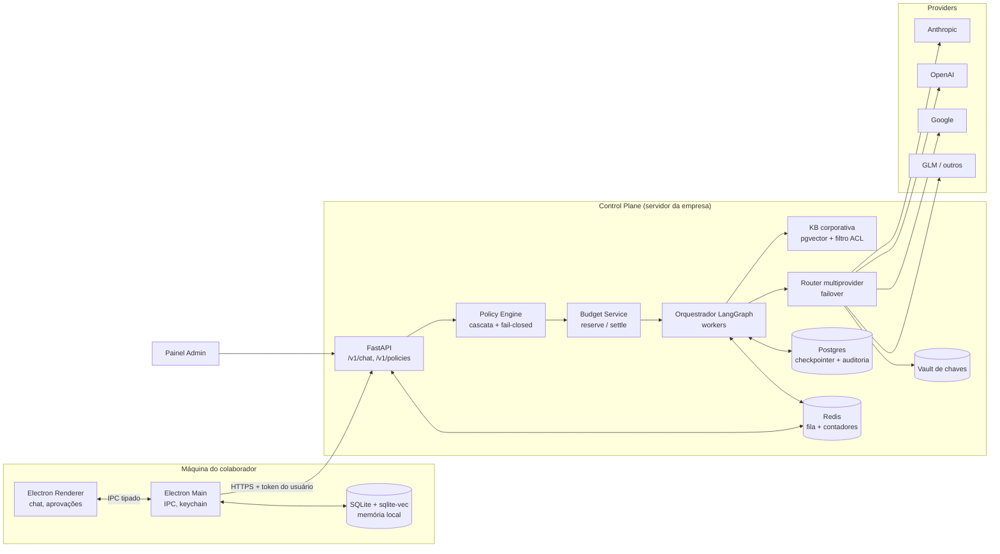
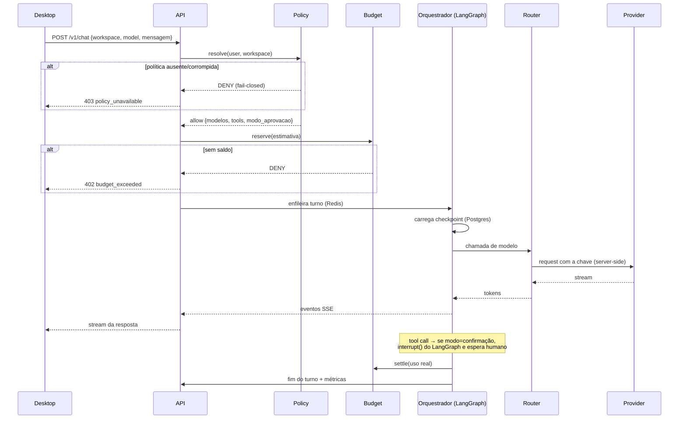

# Arquitetura — Visão Geral

## Regra estruturante

**Três planos, uma direção de confiança.** O Desktop nunca fala com Provider.
Toda decisão (política, budget, modelo, tool) é do Control Plane.

## Componentes

### 1. Desktop (`apps/desktop`)
- Electron: `contextIsolation: true`, `nodeIntegration: false`, `sandbox: true`.
- Renderer não tem acesso a `fs`, `net` nem a segredo. Só IPC via preload allowlist.
- Guarda: token de sessão do usuário e credenciais de ferramentas **no keychain do SO**.
- Memória local: SQLite + `sqlite-vec`, com fallback brute-force se a extensão não
  carregar na plataforma.
- Recebe do Control Plane a lista de modelos e tools **permitidos**. Nada mais aparece na UI.

### 2. Control Plane (`apps/control-plane`)

| Módulo | Responsabilidade |
|---|---|
| `api/` | FastAPI. Autentica, valida entrada, enfileira, faz streaming SSE de volta. **Nunca chama LLM direto.** |
| `policy/` | Resolve política em cascata. Única fonte de verdade sobre "pode ou não pode". Fail-closed. |
| `budget/` | `reserve()` antes do turno, `settle()` depois. Contadores atômicos no Redis, ledger no Postgres. |
| `orchestrator/` | Grafos LangGraph. Roda em **worker**, fora do request HTTP. |
| `router/` | Escolhe provider/modelo, aplica failover, normaliza a resposta. Única camada que toca a chave. |
| `knowledge/` | Ingest + busca na KB corporativa. Filtra por ACL **antes** de devolver ao grafo. |
| `audit/` | Log append-only de decisão de política, uso de tool, tokens e custo. |

### 3. Providers
Atrás de uma interface única. Adicionar provider = implementar um driver + linha de
config de preço. Nenhum outro módulo muda.

## Fluxo de um turno

## Por que LangGraph e não um loop `while`

| Necessidade do produto | Recurso do LangGraph |
|---|---|
| Aprovação humana no meio da execução | `interrupt()` + retomada por checkpoint |
| Turno sobrevive a restart do worker | Checkpointer Postgres |
| Fluxo auditável ("por que o agente fez isso?") | Grafo explícito, cada nó rastreado |
| Subagentes com escopo próprio | Subgrafos |
| Limite de passos, sem loop infinito | Guardas de aresta + `recursion_limit` |

## Decisões de deploy

- API e workers são **processos separados**; escalam independentemente.
- Container multi-stage, base slim, usuário não-root.
- Estado do agente **sempre** no Postgres. Nada de estado em memória de processo —
  é a origem de >60% dos incidentes em agentes de produção.
- OpenTelemetry em cada nó do grafo e cada chamada de tool.

## Onde este projeto pode falhar (e o que vigia isso)

| Falha | Vigia |
|---|---|
| Chave vazar para o cliente | Teste de CI que varre `apps/desktop/**` e o bundle |
| Rota nova esquecer política | Teste que enumera as rotas e exige o middleware |
| Estado perdido em restart | Teste de integração: mata o worker no meio do turno e retoma |
| Custo estourar em silêncio | Alerta em 80% do budget + corte em 100% |
