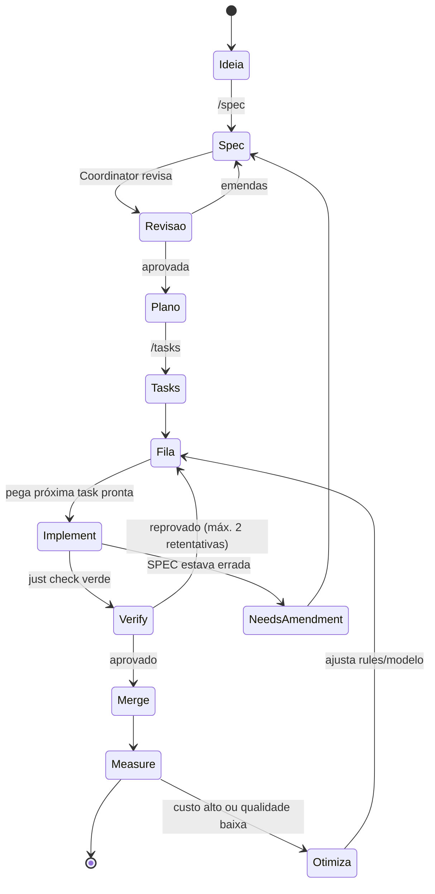

# Pipeline de desenvolvimento (harness que constrói o harness)

Existem **dois** pipelines neste projeto. Não confunda:

| | Pipeline de **desenvolvimento** | Pipeline de **produto** |
|---|---|---|
| O que é | O harness que usamos para construir o harness-corp | O grafo que roda quando um colaborador conversa com o agente |
| Onde | `pipeline/`, `.claude/` | `apps/control-plane/orchestrator/` |
| Quem executa | Você + agentes, na sua máquina | Workers do Control Plane |

Este documento é sobre o **primeiro**.

## Fila, não loop

Regra estruturante: o agente **não** fica em loop livre até "ficar bom". Ele consome
uma fila de tarefas derivadas de SPEC. Tarefa termina em estado definido: `done`,
`blocked` ou `needs-spec-amendment`. Sem teto de tentativas ⇒ custo sem teto.

## Estágios e quem roda

| Estágio | Executor | Entrada | Saída | Gate de saída |
|---|---|---|---|---|
| Spec | agente `spec-writer` | ideia + docs de produto | `specs/SPEC-XXX.md` | Definition of Ready completo |
| Plan | `spec-writer` + humano | SPEC | seção Plano | humano aprova |
| Tasks | `spec-writer` | Plano | seção Tasks | toda task ≤ 1 dia e verificável |
| Implement | `implementor` (1..N) | uma task | diff + testes | `just check` verde |
| Verify | `verifier` | task + diff | relatório com evidência | todos os critérios com prova |
| Measure | script | logs da execução | `metrics/SPEC-XXX.json` | — |

## Paralelismo

Tasks marcadas `[paralelizável]` podem rodar em Implementors simultâneos.
Regras para não virar caos:

- Duas tasks paralelas **não podem** declarar o mesmo arquivo no plano. Se declaram,
  não são paralelas — o plano está errado.
- O Verifier roda depois do merge de cada uma e é quem pega conflito semântico
  (não só textual).
- Máximo de 3 Implementors simultâneos. Acima disso o custo de revisão humana passa
  o ganho.

## Retentativa e teto de custo

| Regra | Valor |
|---|---|
| Retentativas de uma task após reprovar no Verify | 2 |
| Após a 2ª, o item vira | `blocked` → revisão humana obrigatória |
| Teto de custo por task | definido na SPEC; estourou ⇒ para e reporta |
| Teto de turnos por task | 25 |

Estourar teto **não** é falha do agente: é sinal de que a task estava mal fatiada ou
a SPEC ambígua. Vira ajuste de processo, registrado na retro da SPEC.

## Gates automatizados (CI)

`.github/workflows/ci.yml` roda em todo push:

1. `lint` — ruff + eslint
2. `types` — mypy --strict + tsc --noEmit
3. `test` — pytest + vitest
4. `contract` — valida `openapi.yaml` e falha se os tipos gerados estiverem desatualizados
5. `security-invariants` — os gates específicos do produto:
   - nenhum padrão de chave de provider em `apps/desktop/**` nem no bundle
   - nenhum host de provider referenciado no cliente
   - toda rota de inferência passa pelo middleware de política (teste enumera rotas)
   - nenhum `except` engolindo erro de política (fail-open)

O gate 5 é o que diferencia este projeto de um CRUD. Ele nasce **antes** da primeira
feature — é o requisito de `SPEC-000`.

## Seleção de modelo por estágio

Estratégia inicial (revisada a cada 5 SPECs com dados de `metrics/`):

| Estágio | Modelo | Por quê |
|---|---|---|
| Spec / Plan | o mais capaz disponível | é o estágio de maior alavancagem; errar aqui custa a SPEC inteira |
| Implement | modelo médio | tática; a SPEC já reduziu a ambiguidade |
| Verify | modelo capaz, contexto pequeno | precisa de ceticismo, não de volume |
| Measure / scripts | nenhum (determinístico) | não gaste LLM onde `jq` resolve |

Isso é hipótese, não dogma. A Fase 4 mede e corrige.
